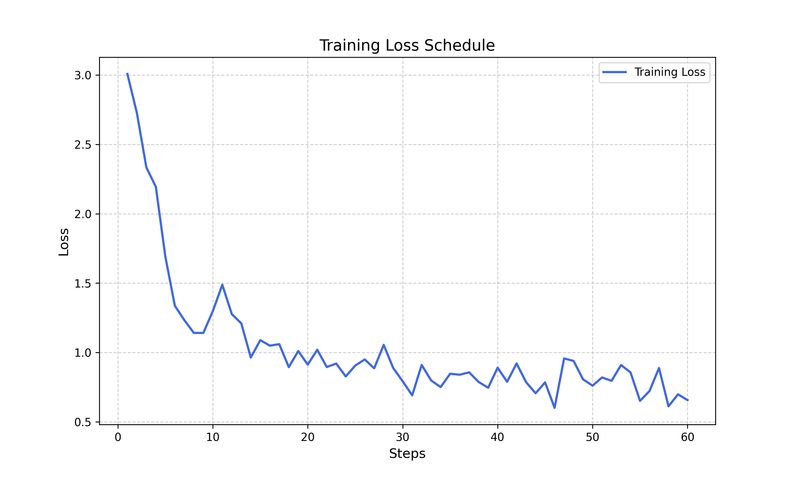
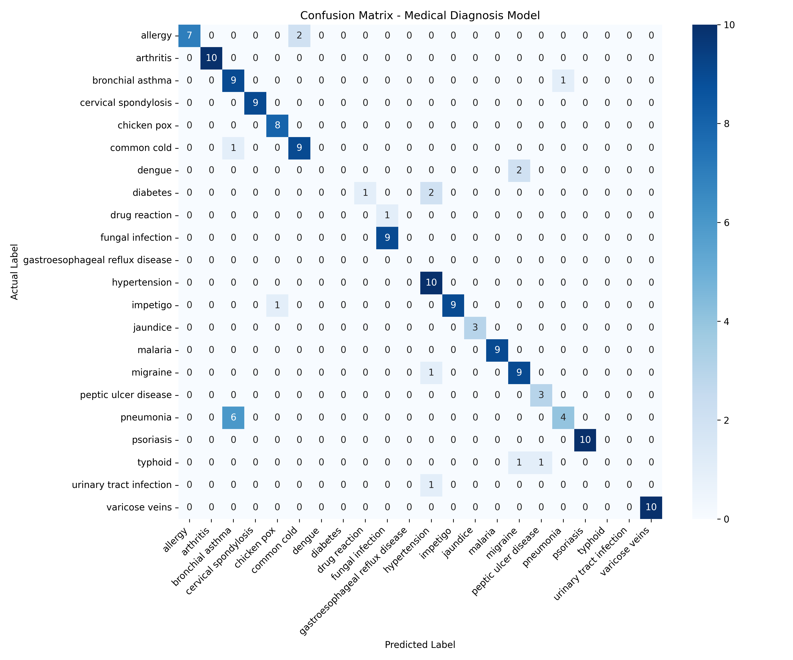

# 🩺 Medical Diagnosis Classifier (Fine-Tuned Mistral-7B)

This repository contains a specialized Large Language Model (LLM) designed to classify medical conditions based on clinical symptoms. By leveraging **Mistral-7B-v0.3** and applying **QLoRA** (Quantized Low-Rank Adaptation) fine-tuning, the model was transformed from a general-purpose assistant into a structured clinical diagnostic tool.

## 🚀 Project Highlights
* **Final Accuracy:** 82% on the test set.
* **Base Model:** Mistral-7B-v0.3 (4-bit quantization).
* **Efficiency:** Fine-tuning performed on a single T4 GPU (Google Colab) using the **Unsloth** framework.
* **Deployment-Ready:** Includes a real-time interactive demo powered by **Gradio**.

## 📊 Performance: The Benchmark
A critical part of this project was comparing the fine-tuned model against the base version. The results demonstrate that fine-tuning is essential for instruction following and domain specialization.

| Metric | Mistral-7B (Base Model) | **Mistral-7B + QLoRA (This Project)** |
| :--- | :--- | :--- |
| **Accuracy** | 0.0%* | **82.0%** |
| **Instruction Following** | Low (Chatty/Verbose) | High (Structured Output) |
| **Hallucination Rate** | High | Low |

*\*The base model fails to return a single label, often providing a list of differential diagnoses or conversational advice, which results in zero accuracy for a strict classification task.*

## 🛠️ Tech Stack
* **Frameworks:** Unsloth, Hugging Face (`peft`, `trl`, `transformers`).
* **Quantization:** BitsandBytes (4-bit NF4).
* **Dataset:** [medical-symptoms-disease-classification](https://huggingface.co/datasets/pavanmantha/medical-symptoms-disease-classification/viewer/default/test?row=20)
* **Interface:** Gradio for real-time inference.

## 🧬 Development Pipeline
1.  **Data Engineering:** Cleaned and mapped the raw dataset into an instruction-based format using a standardized prompt template.
2.  **Memory Optimization:** Utilized 4-bit quantization and Gradient Checkpointing to fit the 7B parameter model into 16GB VRAM.
3.  **Fine-Tuning:** Optimized hyperparameters (Rank=16, Learning Rate=2e-4) to ensure convergence and prevent overfitting.
4.  **Error Analysis:** Implemented a Confusion Matrix to identify symptomatic overlaps.

## 📊 Training & Evaluation Results

> Note: For the full interactive code and training logs, you can [Open this project in Google Colab](https://colab.research.google.com/drive/1Lkj2UmYYEn7oF8kyOoeaJhpV9iZeB5j5?usp=sharing).

## 🧪 Error Analysis & Insights
The confusion matrix revealed that some misclassifications occur in diseases with overlapping clinical presentations. For instance, **Pneumonia** and **Bronchial Asthma** share features like cough and dyspnea, making them a challenge for symptom-only models.




## 🖥️ Usage & Inference
```python
# Use the following code to run a single prediction
symptoms = "I've been feeling very sick. I have a high fever, chills, and severe itching. I've also been sweating a lot and have a headache. I've also been feeling nauseous and have muscle aches."
prediction = predict_desiease(symptoms)
print(f"Predicted Diagnosis: {prediction}") # Output: malaria
